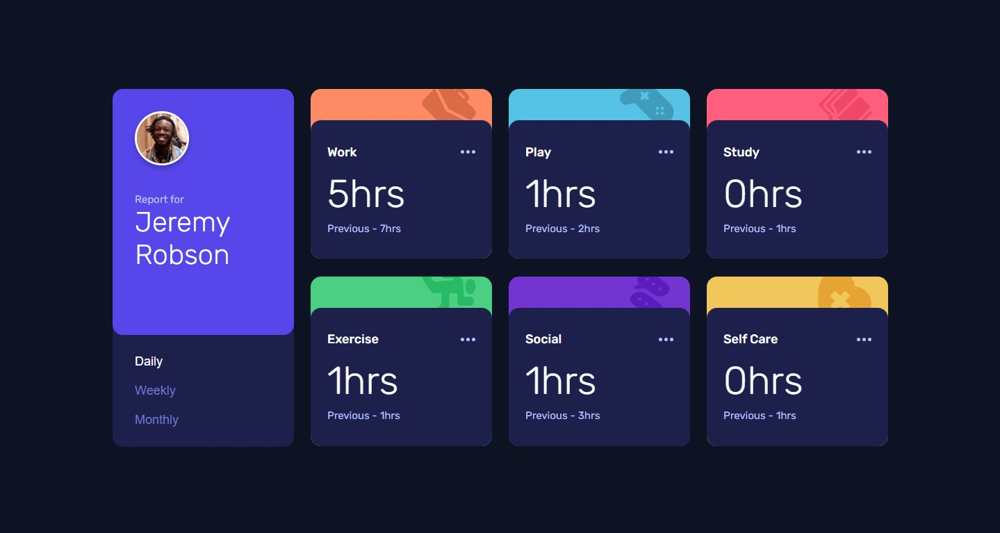

# Frontend Mentor - Time tracking dashboard solution

This is a solution to the [Time tracking dashboard challenge on Frontend Mentor](https://www.frontendmentor.io/challenges/time-tracking-dashboard-UIQ7167Jw). Frontend Mentor challenges help you improve your coding skills by building realistic projects.

## Table of contents

- [Overview](#overview)
  - [The challenge](#the-challenge)
  - [Screenshot](#screenshot)
  - [Links](#links)
- [My process](#my-process)
  - [Built with](#built-with)
  - [What I learned](#what-i-learned)
  - [Continued development](#continued-development)
  - [AI Collaboration](#ai-collaboration)
- [Author](#author)

## Overview

### The challenge

Users should be able to:

- View the optimal layout for the site depending on their device's screen size
- See hover states for all interactive elements on the page
- Switch between viewing Daily, Weekly, and Monthly stats

### Screenshot

### Links

- Solution URL: [GitHub Repository](https://github.com/mnyellison/time-tracking-dashboard)
- Live Site URL: [Vercel Deploy](https://time-tracking-fawn-six.vercel.app/)

---

## My process

### Built with

- Semantic HTML5 markup
- CSS custom properties
- Flexbox
- CSS Grid
- Mobile-first workflow
- Vanilla JavaScript (ES6+)
- Asynchronous Fetch API & JSON handling

---

### What I learned

During this project, I focused heavily on JavaScript architecture, DOM performance, and clean code practices. Instead of writing linear script, I treated the application with a modular mindset, implementing principles used in production-ready environments.

Key concepts mastered in this project:

- **Event Delegation:** Optimized performance by attaching a single event listener to the parent container of the options list, managing the navigation active states dynamically instead of multiplying event handlers.
- **Single Responsibility Principle (SRP):** Refactored the core application flow to isolate the data-fetching mechanism from the UI rendering engine. This resulted in highly specialized, lightweight, and maintainable functions.
- **Dynamic Key Mapping:** Utilized HTML5 `dataset` attributes to bridge the DOM structure and the JSON data structure seamlessly, avoiding rigid hardcoded comparisons.

---

### Continued development

This project is part of a continuous improvement workflow. While the JavaScript logical architecture is complete and fully functional, future updates will focus on:

- Refactoring the markup to enhance semantic HTML and accessibility (a11y).
- Polishing UI spacing, transitions, and hover states to match the design file pixel-for-pixel.
- Enhancing mobile-first CSS grid responsiveness across extra-large and ultra-small viewports.

---

### AI Collaboration

For this challenge, I paired up with Gemini using a collaborative mentorship approach.

- **Approach:** Instead of using the AI to write boilerplate code or copy-paste solutions, I used it to bounce architectural concepts, validate coding decisions, and debate data flow strategies.
- **Outcome:** The collaborative process allowed me to understand the "why" behind asynchronous programming in JavaScript, leading me to design the clean separation of concerns and the array searching logic entirely by myself.

---

## Author

- Frontend Mentor - [@mnyellison](https://www.frontendmentor.io/profile/mnyellison)
